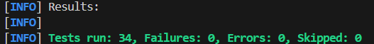

# Binary Calculator WebApp
# Introduction

In modern software development, efficient project management and automation of build processes are crucial for maintaining productivity and consistency. Spring Boot, a popular framework for building Java-based applications, streamlines development by providing pre-configured settings and simplifying dependency management. In this lab, Spring Boot (alongside Maven) and its core functionalities were explored.

# Video
[ommitted from README]

# Test Cases

The test cases for the Binary Calculator Webapp are designed to ensure the accuracy and reliability of the application's functionality. Below is a summary of the test cases as implemented in the Java file:

**Note:** The WebApp and API tests follow the same structure and logic as the first 8 tests listed below.  The API can return as either String or JSON by going to the link at `/add` and `/add_string` respectively.  The last 2 test cases are exclusive to testing the WebApp.  As such, there are 3x8 + 2 = 26 tests in total.

### Input Value test cases
| **Test Case Number** | **Function Tested**      | **Description**                                                                                     | **Input Values**                  | **Expected Values** | **Pass/Fail** |
|---------------------|--------------------------|-----------------------------------------------------------------------------------------------------|-----------------------------------|---------------------|--------------|
| 1                   | `Binary.add()`            | Verify that the addition of two binary numbers is calculated correctly.                             | operand1: "111", operand2: "1010" | "10001"             | Pass         |
| 2                   | `Binary.add()`            | Ensure that adding empty operands returns zero.                                                     | operand1: "", operand2: ""        | "0"                 | Pass         |
| 3                   | `Binary.multiply()`       | Ensure that multiplication of binary numbers is calculated correctly.                               | operand1: "111", operand2: "1010" | "1000110"           | Pass         |
| 4                   | `Binary.multiply()`       | Ensure that multiplying empty operands returns zero.                                                | operand1: "", operand2: ""        | "0"                 | Pass         |
| 5                   | `Binary.or()`             | Verify the OR operation on two binary numbers.                                                      | operand1: "111", operand2: "1010" | "1111"              | Pass         |
| 6                   | `Binary.or()`             | Ensure that OR operation with empty operands returns zero.                                          | operand1: "", operand2: ""        | "0"                 | Pass         |
| 7                   | `Binary.and()`            | Verify the AND operation on two binary numbers.                                                     | operand1: "111", operand2: "1010" | "10"                | Pass         |
| 8                   | `Binary.and()`            | Ensure that AND operation with empty operands returns zero.                                         | operand1: "", operand2: ""        | "0"                 | Pass         |

### Special Tests
| **Test Case Number** | **Function Tested**      | **Description**                                                                                     | **Input Values**                  | **Expected Values** | **Pass/Fail** |
|---------------------|--------------------------|-----------------------------------------------------------------------------------------------------|-----------------------------------|---------------------|--------------|
| 9                   | `getDefault()`            | Verify the correct default view and model attributes when accessing the root URL.                           | URL: "/"                          | View: "calculator", operand1: "", operand1Focused: false | Pass         |
| 10                  | `getParameter()`          | Verify the correct view and model attributes when accessing the root URL with a parameter.                  | URL: "/", param: "operand1=111"   | View: "calculator", operand1: "111", operand1Focused: true | Pass         |

### Test Results
  
  
**Note:** The additional 8 test cases are from part I of this lab (`HelloController.java`/`HelloAPIController.java`).  